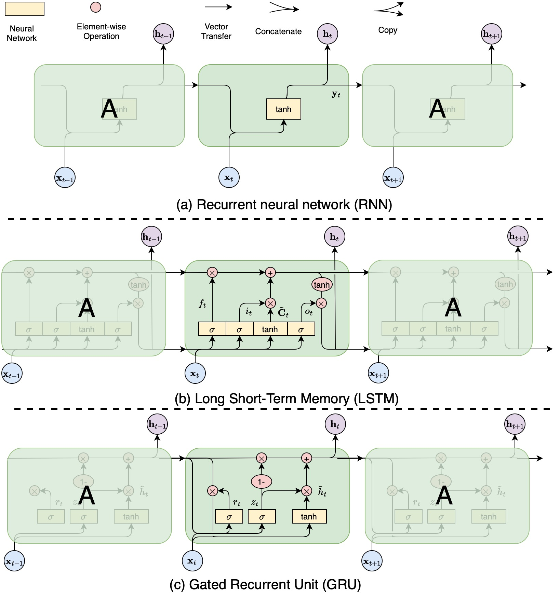

# Maybe Transformer-like RNN will be the future
## Introduction
Transformer-based 模型如GPT-series、Llama-series、Baichuan-series 等已充分证明其有效性，然而它们仍存在较为显著的问题，如模型训练/推理速度慢、推理长度受限、模型规模过大等。在此背景下，模型轻量化(Model Light-Weighting, MLW)是沿着大模型训练/推理加速(speed up)、瘦身（slimming）等方向所提出的一系列方法的总称，跨越了整个[模型生命周期](https://blog.csdn.net/universsky2015/article/details/136413022)，如图一所示。
  
**图一：轻量化在模型生命周期中的相关技术。**  
  
- 模型设计阶段：在模型设计阶段，模型轻量化通常设计新的、更加轻量的架构以代替传统的Transformer架构。Transformer-like RNN架构就是这一阶段中所产出的重要方法之一。

- 模型训练阶段：在模型训练阶段，模型轻量化通常对现有的梯度更新策略进行优化，以加速模型损失函数收敛。梯度裁剪、梯度放缩、贝叶斯梯度区间估计是这一在这一阶段的重要科研产物。

- 模型部署阶段：在模型部署阶段，模型轻量化通常对现有模型进行量化压缩、低秩分解等方法获得精度略低、内存占用较小的模型。

- 模型监控与优化：在监控优化阶段，模型轻量化通常对现有模型进行剪枝、知识蒸馏等方法降低模型知识冗余以及模型规模。 

一方面，通过轻量化技术可降低模型训练/推理成本，推动大模型的应用落地发展；另一方面，轻量化技术也可与其他领域相结合，实现成果高效转化，如与深度联邦学习、深度强化学习等。此外，亦可与多种应用场景相结合，如图像生成、视频生成、语音生成等。

总而言之，模型轻量化是机器学习领域的一项基础研究，其发展将极大助力人工智能的发展与应用。

## Related Works
尽管基于Transformer的各种模型在多种任务中取得了十分亮眼的成果，但仍不可忽视其在 **自回归任务** 上推理缓慢的缺陷。这种缺陷是其模型先天架构的不足所导致的 *（此处仅为自回归Transformer!!!）*。 **主要原因是每生成一个Token，均需要计算所有Token的Attention**。但此问题并非无解，在不改变架构的情况下，可通过KV cache技术缓解，如外部注意力(External-Attention, EA)[1]等。本节，将系统阐述模型轻量化在模型生命周期的各个阶段的研究工作。

### Phase in the Model Design
在模型设计阶段，轻量化工作特别是大模型的轻量化工作，集中于降低Transformer架构的冗余性。根据现有方法，本文将其分为四大类：  

| **Model Family**         	| **Statement**             	| **Representation** 	|
|--------------------------	|---------------------------	|--------------------	|
| Transformer-based RNN    	| 类Attention的门控网络     	| RWKV[2]            	|
|                          	|                           	| Mamba[3]           	|
|                          	|                           	| Griffin[4]         	|
| Mixer-based Transformer  	| 以特征混合器替代Attention 	| MLP-Mixer[5]       	|
|                          	|                           	| ResMLP[6]          	|
|                          	|                           	| FNet[7]            	|
|                          	|                           	| SGConv[8]          	|
| Gate-based Transformer   	| 以门控网络替代Attention   	| gMLP[9]            	|
|                          	|                           	| gSwin[10]          	|
| Linear-based Transformer 	| 以线性网络替代Attention   	| Linformer[11]      	|
|                          	|                           	| Cosformer[12]      	|
|                          	|                           	| AFT[13]            	|
|                          	|                           	| TransNormerLLM[14] 	|  

#### Self Attention with Transformer
在阐述上述四类工作之前，本文将介绍传统的点积注意力(Dot Product Attention, DPA)。  
```math
V \coloneqq \mathrm{X}W^{V}, K \coloneqq \mathrm{X}W^{K}, Q \coloneqq \mathrm{X}W^{Q},  \qquad (1)
```
```math
A_t^{'} \coloneqq \mathrm{Q}_t \mathrm{K}^{\top},  \qquad (2)
```
使用softmax归一化注意力：  
```math
A_{t,i} \coloneqq \frac{exp(A_{t,i}^{'})}{\textstyle\sum_{j=0}^{L-1}exp (A_{t,j}^{'})} , \qquad  (3)
```
使用注意力分数加权$V$，得到最终的Token表示：  
```math
Z_t \coloneqq A_t \mathrm{V}, \qquad (4)
``` 
式(2)-(4)可合并写为：  
```math
Z_t \coloneqq \sum_{j=0}^{L-1} \underbrace{softmax(\mathrm{QK^{\top}})}_{\text{full-attention weights}} \cdot \mathrm{V}_i, \qquad (5)
``` 
当输入三者相同时，即均为$\mathrm{X}$时，为自主意力(Self Attention)。如式(5)所示，full-attention weights是$A^{'}$的归一化结果，现不采用归一化，则式(5)可表示为:  
```math
\begin{aligned} Z_t & \coloneqq \underbrace{\mathrm{QK^{\top}}}_{A^{'}(eq.2)} \cdot \mathrm{V}_i \\
& = \mathrm{X}W^{Q}(\mathrm{X}W^{K})^{\top} (\mathrm{X}W^{V}) \\
& = \mathrm{X} (W^{Q}W^{K\top}) \mathrm{X}^{\top} (\mathrm{X}W^{V}) \\
& = [\mathrm{X}W^{G}\mathrm{X}^{\top}]\mathrm{X}W^{V} \\
& = A^{'} \mathrm{X} W^{V}
\end{aligned},
 \qquad (6)
 ```
如式(6)所示, $W^{G}=W^{Q}W^{K\top}$ 且 $A^{'} =\mathrm{X}W^{G}\mathrm{X}^{\top}$。  
#### Transformer-based RNN
鉴于RNN结构在递归推理上的具有线性复杂度的特点，以RWKV[2]、Mamba[3]以及Griffin[4]为代表的模型将RNN优点与Transformer优点相结合，以实现推理线性复杂度和超长序列推理等能力。 下面，先对RNN[15]、LSTM[16]以及GRU[17]模型(如图2所示）进行分析，研究其内在数学原理，以更好的理解RNN-based Transformer模型的思想。
  
**经典的RNN模型：(a)循环神经网络RNN；(b)长短期记忆网络LSTM;(c)门控神经网络GRU.**

##### RNN
对于时间步$t$,输入向量为 $\mathbf{x}_t \in \mathbb R^d$ ,隐状态向量为 $\mathbf{h}_t \in \mathbb{R}^h$ ,输出向量为 $\mathbf{y}_t \in \mathbb{R}^q$ ,$\circ \mathbf{W}_{xh} \in \mathbb{R}^{h \times d}$是输出权重矩阵, $\mathbf{W}_{hh}\in \mathbb{R}^{h\times h}$ 是隐状态权重矩阵，$\mathbb{W}_{hy} \in \mathbb{R}^{q \times h}$ 是输出权重矩阵， $\mathbf{b}_h \in \mathbb{R}^h$ 是偏置向量。  
RNN的更新公式为：  
```math
\begin{aligned} \mathbf{h}_t &= \sigma (\mathbf{W}_{xh}\mathbf{x}_{t}+\mathbf{W}_{hh}\mathbf{h}_{t-1}+\mathbf{b}_h) \\
\mathbf{y}_t &= softmax(\mathbf{W}_{hy}*\mathbf{h}_t), 
\end{aligned}
```

## Reference  
[1] Guo M H, Liu Z N, Mu T J et al. Beyond Self-attention: External Attention using Two Linear Layers for Visual Task [J]. IEEE Transactions on Pattern Analysis and Machine Intelligence, 2023(45):5436-5447.

[2] Peng B, Alcaide E, Anthony Q et al. RWKV: Reinventing RNNs for the Transformer Era [J/OL]. arXiv, 2023, cs.CL/2305.13048. https://arxiv.org/pdf/2305.13048.pdf

[3] Gu A and Dao T. Mamba: Linear-Time Sequence Modeling with Selective State Spaces [J/OL]. arXiv, 2023, cs.LG/2312.00752. https://arxiv.org/ftp/arxiv/papers/2312/2312.00752.pdf

[4] De S, Smith S L, Fernando A et al. Griffin: Mixing Gated Linear Recurrences with Local Attention for Efficient Language Models [J/OL]. arXiv, 2024, cs.LG/2402.19427. https://arxiv.org/pdf/2402.19427.pdf

[5] Tolstikhin I O, Houlsby N, Kolesnikov A et al. MLP-Mixer: An all-MLP Architecture for Vision [C]. In NeurIPS 2021, virtual, 2021:24261-24272.

[6] Touvron H, Bojanowski P, Caron M et al. ResMLP: Feedforward networks for image classification with data-efficient training [J/OL]. arXiv, 2021, cs.CV/2105.03404. https://arxiv.org/pdf/2105.03404.pdf

[7] Lee-Thorp J, Ainslie J, Eckstein I et al. FNet: Mixing Tokens with Fourier Transforms [C]. In ACL 2022, Seattle, US, 2022:4296-4313.

[8] Li Y H, Cai T L, Zhang Y et al. What Makes Convolutional Models Great on Long Sequence Modeling? [C]. In ICLR 2023, Kigali, Rwanda, 2023. https://arxiv.org/pdf/2210.09298.pdf

[9] Liu H, Dai Z, So D et al . Pay attention to mlps [J] . Advances in Neural Information Processing Systems, 2021, 34:9204-9215.

[10] M. Go and H. Tachibana. GSWIN: Gated MLP Vision Model with Hierarchical Structure of Shifted Window [C]. ICASSP 2023 , Rhodes Island, Greece, 2023, pp. 1-5.

[11] Wang S N, Li B Z, Khabsa M et al. Linformer: Self-Attention with Linear Complexity [J/OL]. arXiv, 2020, cs.LG/2006.04768. https://arxiv.org/pdf/2006.04768.pdf

[12] Qin Z, Sun W X, Deng H et al. cosFormer: Rethinking Softmax In Attention [C]. In ICLR 2022, 2022, virtual. https://arxiv.org/pdf/2202.08791.pdf

[13] Zhai S F, Talboot W, Srivastava N et al. An Attention Free Transformer [C]. In ICLR 2021, virtual, 2021. https://arxiv.org/pdf/2105.14103.pdf

[14] Qin Z, Li D, Sun W G et al. TransNormerLLM: A Faster and Better Large Language Model with Improved TransNormer [J/OL]. arXiv, 2023, cs.CL/2307.14995. https://arxiv.org/pdf/2307.14995.pdf

[15] Jordan I. M. Serial Order: A Parallel Distributed Processing Approach[J]. Advances in Psychology. 1997, 121:471-495. 

[16] Hochreiter S, Schmidhuber J. Long Short-Term Memory[J]. Neural Computation. 1997, 9:1735-1780.

[17]  Chung J, Gulcehre C, Cho K et al. Empirical Evaluation of Gated Recurrent Neural Networks on Sequence Modeling[C]. In NIPS 2014. 2014. 